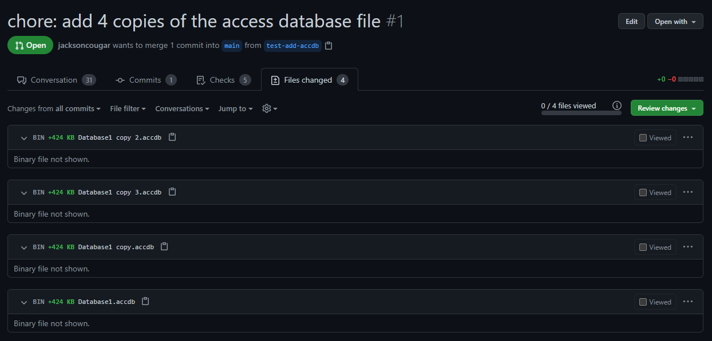
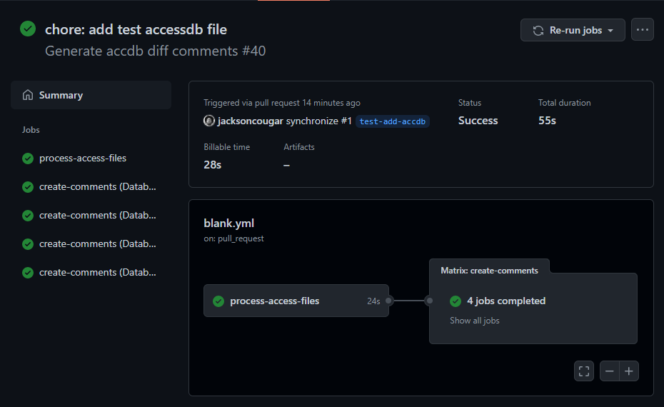
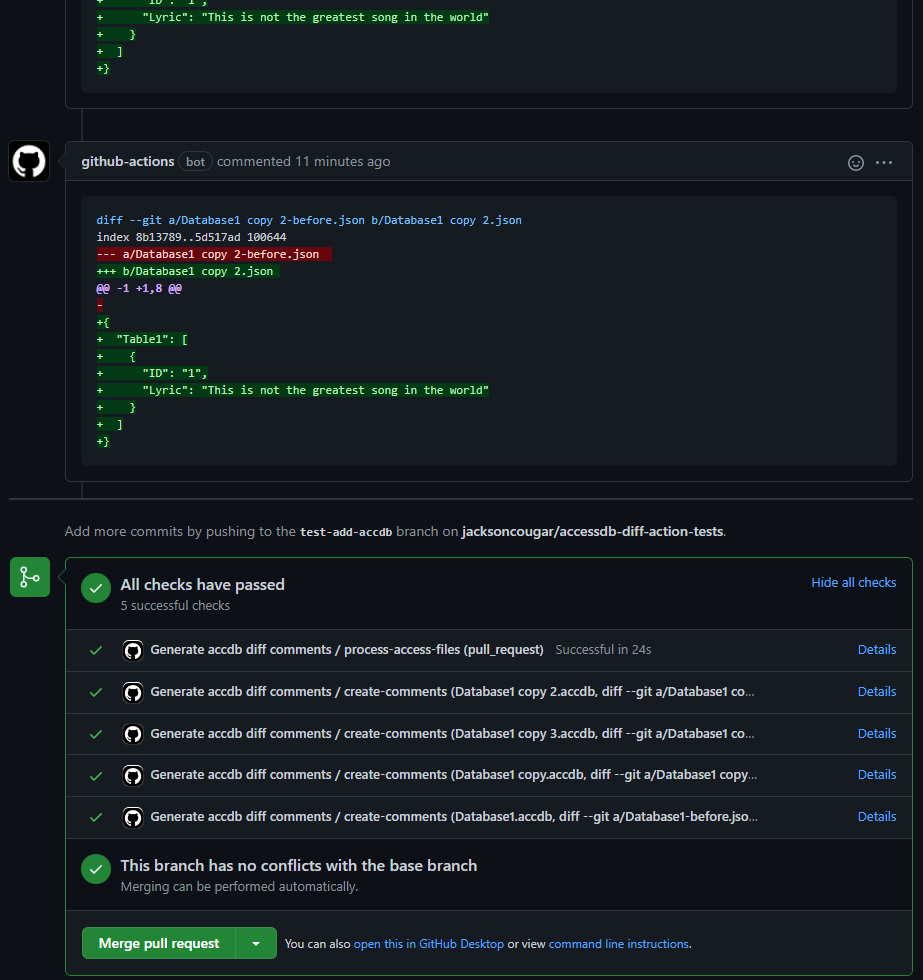

# Access Database File Diff Action

This action generates JSON diffs for Access Database (accdb) files within the pull request.
These diffs can then be used in other steps of your workflow to generate comments, or send alerts, etc.

## Usage/Examples

Here is an example workflow that integrates the `access-database-file-diff-action`
to generate a `diff` comment for each Access Database file:

````yaml
name: Generate Access Database diff comments

on:
  pull_request:
  workflow_dispatch:

jobs:
  process-access-files:
    runs-on: ubuntu-latest
    outputs:
      diffs: ${{ steps.accdb-diff.outputs.accdb-diffs }}

    steps:
      - name: Checkout code
        uses: actions/checkout@v2
        with:
          fetch-depth: 0

      - name: Generate Access Database file diffs
        id: accdb-diff
        uses: JacksonCougar/access-database-file-diff-action@main

  create-comments:
    needs: process-access-files
    runs-on: ubuntu-latest
    strategy:
      matrix: ${{ fromJson(needs.process-access-files.outputs.diffs) }}
    steps:
      - name: Generate comment
        id: add-comment
        env:
          comment: "```diff\n${{ matrix.files.text }}\n```"
        run: |
          curl -s -H "Authorization: token ${{ secrets.GITHUB_TOKEN }}" \
            -X POST -d '{"path": ${{ toJson(matrix.files.name) }}, "position": 0, "body": ${{ toJson(env.comment) }}}' \
            "https://api.github.com/repos/${{ github.repository }}/issues/${{ github.event.number }}/comments"
````

There are two outputs returned by `access-database-file-diff-action`:
`has-accdb-files`: `true` if Access Database files were found.
`accdb-diffs`: a json object that contains the diff information of each Access Database file.
The schema of the json object looks like this:

```json
{
   "files":
    [
        {
            "name": string
            "text": string
        },
        ...
    ]
}
```


## Screenshots





